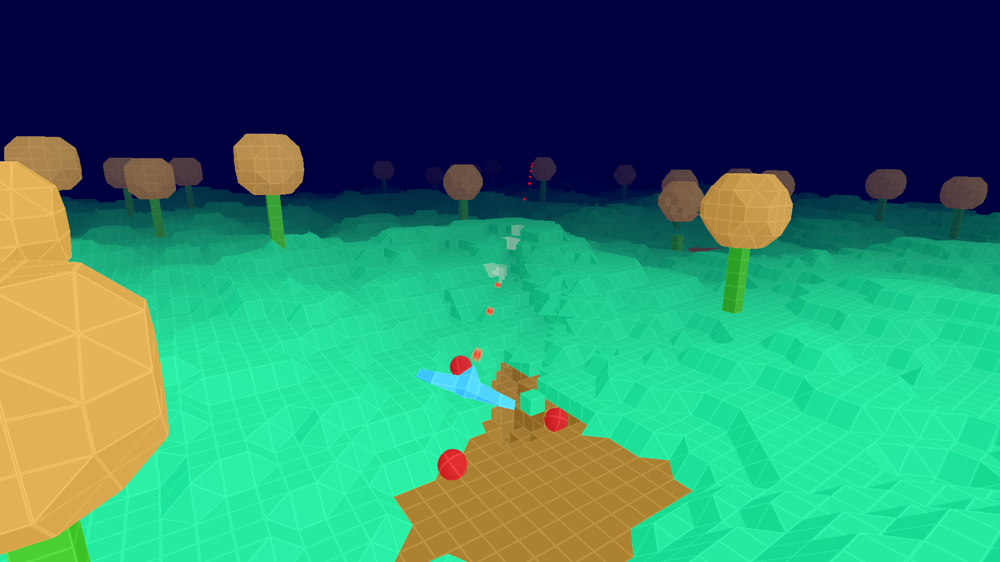

**Turbostomp** is going to be an OpenGL game in C++ using [pgamecc][].

  [pgamecc]: //github.com/zholos/pgamecc



Install pgamecc:

```
$ git clone git://github.com/zholos/pgamecc
$ cd pgamecc
$ cmake -DCMAKE_INSTALL_PREFIX=$HOME/opt .
$ make install
```

Build Turbostomp:

```
$ git clone git://github.com/zholos/turbostomp
$ cd turbostomp
$ cmake -DCMAKE_PREFIX_PATH=$HOME/opt .
$ export PATH=$PATH:$HOME/opt/bin
$ make
```

Run demo:
```
$ ./levels/demo
```
